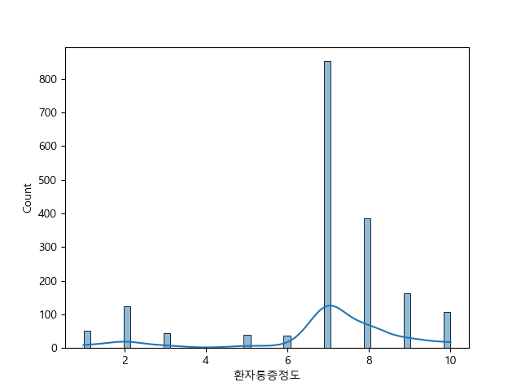
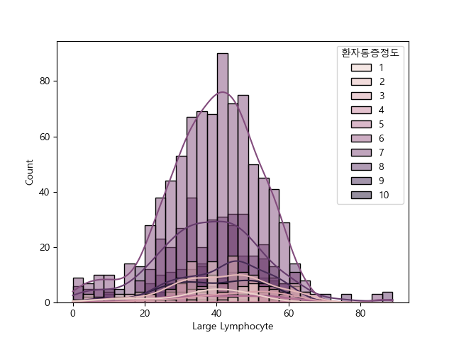
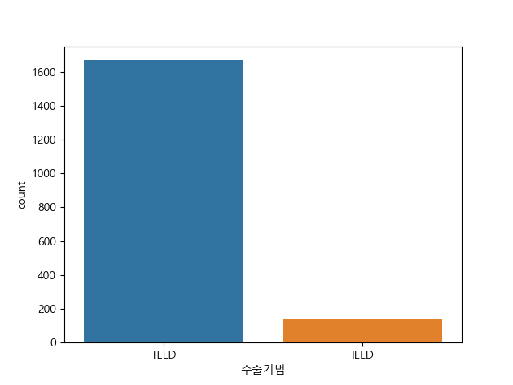

#  📂project : Recurrence Of Surgery(수술 재발)
**척추병원 진료 데이터 시각화 및 머신러닝**
  - data from postman

## 📝분석목적
- 서비스 제공 대상 : 제약 회사 
- 분석 목적 : 환자통증정도와 관련된 입원/통증 기간 분석, 환자 특성 변화 분석 등
    - 입원/통증 기간 분석
        - '입원기간'과 '통증기간(월)' 등의 데이터를 활용하여 환자들의 치료 /통증기간과 효과를 분석하고자 한다.
        -  제품이 어떤 기간 동안 환자의 상태 개선에 도움이 되는지를 확인하여 제품 효과를 검토할 수 있다.
    - 환자 특성 변화 분석
        - 환자들의 연령, 성별, 체중 등 특성을 파악하여 제약회사의 대상 구매고객의 프로필과 대조 분석한다(추후)
        - 이를 통해 어떤 연령층이나 성별에 해당하는 환자들에게 제품 또는 서비스를 맞춤화하여 제공할 수 있는지 확인하고자 한다.

## 📚분석 대상 변수 및 선택한 이유 

| 변수    | 변수의 설명   | 데이터 분류 | 변수 선택 이유 |
|------|------|-----|------|
| 환자통증정도  | 환자의 통증 정도 | 이산형 | 해당 수치관련된 입원/통증 기간 분석, 환자 특성 변화 분석하고자 함   |
| 입원기간   | 입원 기간   | 날짜형 | 환자통증정도에 따라 입원기간에 영향을 미치는지 확인하고자 함|
| 통증기간(월)   | 통증 기간 (월) | 이산형 | 환자통증정도에 따라 통증기간에 영향을 미치는지 확인하고자 함  |
| 체중   | 환자의 체중   | 연속형 | 환자의 특성을 분석하고자 함|
| 연령     | 환자의 연령   | 연속형  | 환자의 특성을 분석하고자 함.(추후 마케잍 대상 연령대를 파악하기 위함)|
| Large Lymphocyte  | 대형 림프구 수치  | 연속형 |  면연력과는 어떠한 영향이 있는지 확인하고자 함|
| 수술기법  | 수술 기법  |명목형 | 수술기법에 따라 제공될 상품(약)이 달라지기에 환자통증에 따른 수술기법이 어떠한 영향이 있는지 확인 하고자 함   |

## 일부 시각화 

목적변수인 환자통증정도의 시각화

림프구와 환자통증정도의 시각화

수술기법의 시각화

## 📋분석 결과 
### 📝 분석결과 수치 
| 변수  | p-value 값 | 분석결과        |
|------|------|-----|
| 환자통증정도  |pvalue=8.12e-44  |환자통증정도는 정규 분포가 아니다.  | 
| 입원기간   |pvalue=2.0e-06  | 입원기간에 따라서 환자통증정도가 변화가 있다.| 
| 통증기간(월)   |pvalue=0.5147 | 통증기간에 따라서 환자통증정도가 변화가 없다. | 
| 체중   | pvalue=0.25 |연령에 따라서 환자통증정도가 변화가 없다.  |
| 연령     |pvalue=0.275| 체중에 따라서 환자통증정도가 변화가 없다.| 
| Large Lymphocyte  | pvalue=0.352  |림프구 수치에 따라서 환자통증정도가 변화가 없다. | 
| 수술기법  |pvalue=1.0   |환자통증정도의 평균에 차이 없다. | 
- 입원기간은 환자통증정도에 영향을 미친다는 것을 확인함.
- '통증기간(월)', '연령', '체중', 'Large Lymphocyte', '수술기법'는 환자통증정도에 영향을 끼치지 않음을 확인함.

### 📝 머신러닝 평가를 통한 예측의 결과값
- 정확도(accuracy) :0.988  --> 높은 정확도로, 모델이 예측을 매우 잘 수행함
- precision, recall, f1-score : 0.99
    - 높은 정밀도, 재현율, F1 점수를 갖고 있음 -->  이 모델은 양성과 음성 클래스 모두를 높은 성능으로 예측하고 있음

## ✔️분석 후  느낀점 
- 시각화를 통해 내가 설정한 목표변수와 설면변수의 미치는 관계를 살펴보면서 분석하고자 하는 목적에 도움이 될만한 설명변수들인지를 확인하는 연습이 되어진 프로젝트였다. 변수들의 데이터 유형에 따라 검증하는 방법이 달라지는데 이번 프로젝트 덕분에 연속형/범주형에 따라 검증하는 방법을 연습하고 확실히 익힐 수 있는 좋은 기회가 되었다.
- '결측치'를 어떻게 처리를 해야지 효율적인 분석이 될지 생각해보게 되는 프로젝트였다. 결측치를 단순히 제거하는 방법이 아니라, 데이터가 많아야 머신러닝을 돌리기 수월하기에 결측치를 처리하는 여러가지 방법을 배울 수 있었다. 또한, 결측치 처리기준에 대해 명확히 알게 되었다. 전처리하는 과정에서도 이중으로 동일한 작업이 진행되지 않게금 효율적으로 진행되는 순서에 대해서도 생각해볼수 있었다. 결론적으로 해당 프로젝트 덕분에 결측치를 처리하는 다양한 방법들을 알게 되었으며, 전처리 과정이 데이터 분석에 얼마나 많은 영향을 미치는지 알게되는 프록젝트 였다.

## ✔️ 사용기술 
      

